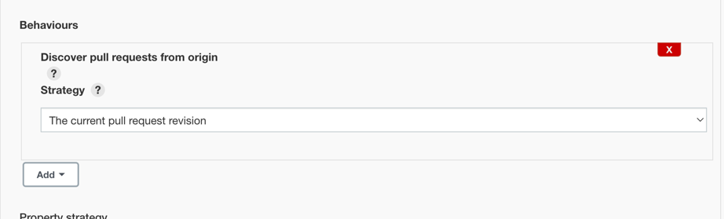
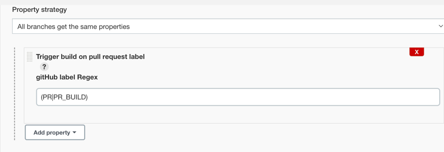

> NOTE: This plugin is incompatible with version 2.177 of Jenkins.

# GitHub Pull Request label Build Plugin

## About this plugin

This plugin listens the labeled gitHub event on pull requests and will trigger a GitHub multibranch
job if a label matches the configured value.
This is implemented as a branch property on multibranch jobs.

### Setup
For the plugin to work your multibranch job must use one of the "Discover pull requests from..." behaviors.
For example:

To enable the plugin's functionality, simply add one or more of the branch properties from
this plugin to the multibranch job and configure the regular expression to
match against the gitHub labels.

Please ensure that you have a GitHub server properly connected via the Jenkins configuration,
or else the plugin will not operate correctly.

### Regular expression matching

Please use label regex as (PR|PR_BUILD) for triggering the build on PR or PR_BUILD label.

## Changelog

#### 1.0 (April 18, 2023)

Initial release

## Plugin maintenance

### Releasing new versions

Use the instructions found [in the Jenkins docs](https://www.jenkins.io/doc/developer/publishing/releasing/).
